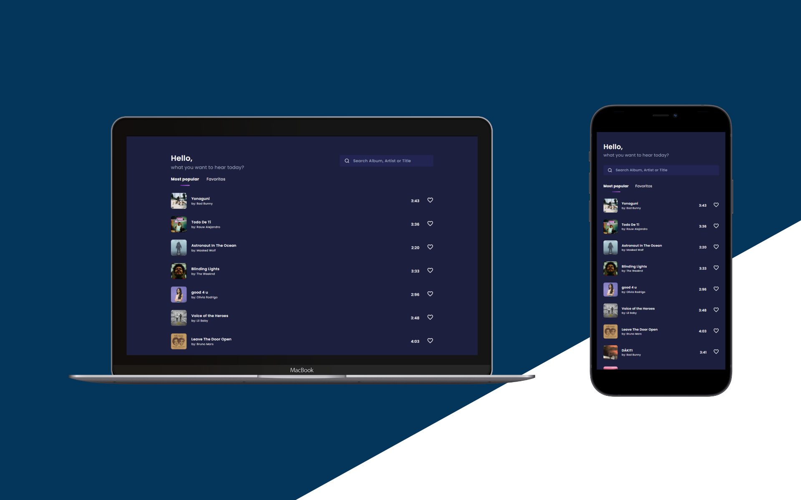

# Manipulaê Challenge [Music App](https://next-manipulae-challenge.vercel.app/)

<br>

## Desafio

Desenvolver um app de músicas consumindo a API do deezer.
<br>

## Technologies

Technologies and tools used in the development of the project:

- [Next.js](https://nextjs.org/)
- [TypeScript](https://www.typescriptlang.org/)
- [Styled Components](https://styled-components.com/)
- [Redux](https://redux.js.org/)
- [Axios](https://github.com/axios/axios)
- [Moment](https://github.com/moment/moment/)
- [Immer](https://immerjs.github.io/immer/)
- [Jest](https://jestjs.io/)
<br>

## Deploy

App implementando na vercel, disponível [aqui](https://next-manipulae-challenge.vercel.app/)
<br>

## Etapas / Dificuldades

**\#1 .. Design:**

Eu já sou meio entusiasta para design, escolher um que fosse ao mesmo tempo impressionante, usável e "fácil" de implementar, pois afinal o tempo era curto, esse equilíbrio de UI / UX foi meio difícil, para a página Home me inspirei inicialmente [neste design](https://dribbble.com/shots/15593083-Podcast-App) do [Herdetya Priambodo](https://dribbble.com/herdetya), porém eu precisava da responsividade e o código começou a ficar muito verboso e incontrolável na criação do componente Player ai surgiu a segunda dificuldade...

**\#2 .. Cenários de UX:**

Para criação do componente Player me inspirei no **YoutubeMusic**, ele trata dois cenários de usabilidade (Mobile e Web) e dois comportamentos do componente em ambos (Maximizado e Minimizado), no total quatro cenários para tratar, solução... tive que criar dois Layouts/Components PlayerMobile e PlayerWeb, eu reaproveitei bastante código de lógica e apenas alterei o layout, pronto estética finalizada, vamos entrar na lógica...

**\#3 .. Contextos:**

**Player:** Primeira necessidade, como saber se player deve aparecer ou não? e se preview conter erro na sua reprodução? Normalmente utilizaria do ContextAPI do próprio React, mas para obedecer ao escopo do projeto, usei Redux para criação do contexto e saga para criar middleware que valida se URL do preview de 30 segundos da música está acessível.

**Tracks:** Segunda necessidade, cliquei em uma música, como acessar a próxima da lista ou a anterior? Outro contexto... cenários: mais populares, favoritos e pesquisa, todos buscam as músicas que estariam disponíveis para usuário navegar, então em cada uma das buscas o contexto é populado, problemas: se observamos um pouco mais fundo nas regras de negócio, o usuário normalmente pode iniciar uma Rádio, Playlist ou Parada a partir da música escolhida, devido ao tempo para entrega do desafio, não tratei essas regras, então se usuário mudar a listagem com outras músicas, automaticamente ele perde contexto da lista que estava tocando anteriormente. 🤷‍♂️

**Favorites:** Terceira necessidade, que na verdade foi a primeira que desenvolvi, muito simples, contexto para salvar músicas favoritas.

**\#4 .. Implementar Audio... Lógica do HTMLMediaElement:**

Eu nunca construir player de música então, fiquei com enorme dúvida de qual a melhor estratégia, e errei primeiro, eu instanciava um new Audio() e removia o anterior, problema: eventos de tempo (setTimeout, setInterval) ou até de animação (requestAnimationFrame) possuem clearTimeout, clearInterval e cancelRequestAnimationFrame, o áudio não, ele fica na memoria e as músicas tocavam uma por cima das outras 🤯, vamos lá a solução, cenários: o usuário pode clicar na mesma música para iniciar uma “Playlist” a partir dessa novamente várias vezes ou na atual clicar para próxima ou anterior, vamos usar React a nosso favor, adicionei a tag ```<audio>``` e usei useRef para ter a referência, ela estando presente na DOM quando o componente é desmontado, ela é removida com todos seus eventos, primeiro problema resolvido, segundo: ao invés de iniciar um novo áudio alterei o src do atual para apenas trocar referência da música, o resto foi usabilidade, quando chegar ao final da música ir para próxima, ao chegar ao final da Playlist pausar na interface, bloquear de ir para próxima se não existir próxima, dar visual a isso, etc...

**\#5 .. CSS Limitado?**

Sempre há um momento em que simplesmente não é possível resolver um problema com aquela ferramenta específica, tive que pensar um pouco fora da caixa e incluir javascript para auxiliar, encontrei casos de títulos de músicas longos e que não haviam espaços (" "), ou seja, o css não consegue quebrar a linha, esses casos prejudicavam meu layout de listagem, resultado eu peguei a referência de alguns elementos com useRef para calcular exatamente qual o maxWidth que o elemento precisava para manter seu espaço no meu layout, resolvido! Apliquei está técnica no PlayerMobile minimizado também e com adição de uma animação para título se mover quando maior que o esperado, eu achei bem astuto modesta parte.

**\#6 .. Bugs:**

De praxe... bugs, no caso só um e em ambiente de desenvolvimento, eu desconfio, mas não tenho certeza de que a configuração do PWA para NextJS pesa um pouco em desenvolvimento, seria melhor eu ter feito todo app e configurado PWA depois.

**Ocorrência:** a imagem da primeira faixa tocada assim que app é carregado fica piscando, a partir das próximas faixas isso não ocorre e debugando pela extensão do React, o elemento não sofre alterações nas re-renderizações do React, novamente, em produção o problema não ocorre.

**\#7 .. Testes:**

Criei testes apenas para verificação da renderização, na página Home testei também a busca da lista inicial de músicas (getStaticProps - SSR) e a action de requisição de reprodução da música (Redux), eu gostaria de ter feito testes mais profundos em específico com Redux, porém o tempo era curto, então me mantive raso nesse mérito.

<br>

## Bônus Cenário de Falha em Produção

Tive a ideia de corromper a url das músicas na pesquisa em que o título der match com “test”, primeiro queria apenas testar uma falha no middleware do Redux, mas mantive para apresentação, então fique à vontade para brincar com esse “recurso”. 😅 
<br>

## Diferenciais

- PWA e Busca automatizada implementados. ✅

- Quando usuário digita 3 caracteres ou mais e não há mais atividade por 500ms a busca é iniciada.

- Usabilidade do Youtube Music, player nasce minimizado clique para maximizar.


<br>

## Run Project

Add dependencies:


```
yarn

```
Run app:


```
yarn dev

```
Run tests:


```
yarn test

```
<br>

## Licença
<a href="https://opensource.org/licenses/MIT">
    
</a>
<br>

---
Made with 💖 by [**mmarinhomac**](https://github.com/mmarinhomac)